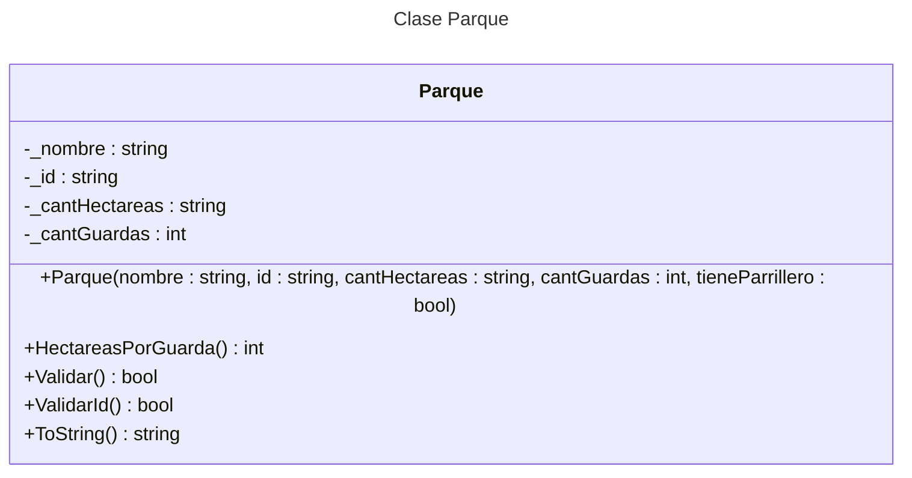

# Ejemplo clase Parque

## Diagrama UML



## Código

```c#
namespace Consola
{
    internal class Parque
    {
        private string _nombre;
        private string _id;
        private int _cantHectareas;
        private int _cantGuardas;
        private bool _tieneParrilleros;

        public Parque(string nombre, string id, int cantHectareas, int cantGuardas, bool tieneParrilleros)
        {
            _nombre = nombre;
            _id = id;
            _cantHectareas = cantHectareas;
            _cantGuardas = cantGuardas;
            _tieneParrilleros = tieneParrilleros;
        }

        private bool ValidarId()
        {
            return !string.IsNullOrEmpty(_id) && _id.Length == 6;
        }

        public bool Validar()
        {
            return !string.IsNullOrEmpty(_nombre) && _cantHectareas > 0 && _cantGuardas >= 0 && ValidarId();
        }

        public override string ToString()
        {
            return $"Nombre: {_nombre} - Id: {_id} - Hectareas: {_cantHectareas} - Guardaparques: {_cantGuardas} - Parrilleros? : {_tieneParrilleros} - Guardas/Parque: {HectareasPorGuarda()}";
        }

        public int HectareasPorGuarda()
        {
            return _cantHectareas / _cantGuardas;
        }

    }
}
```