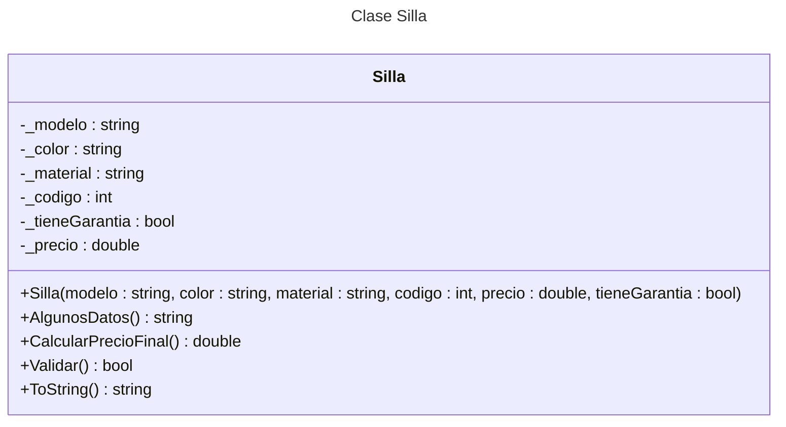

# Programación Orientada a Objetos

- Intenta modelar objetos de la vida real
- Es una manera de construir software
- Podemos modelar entidades tangibles o intangibles
- Podemos compartir responsabilidades
- Facilita la encapsulación y la protección de datos

## Elementos
 
Una **clase** es una plantilla por la cual instanciamos a los **objetos**.

Los elementos básicos de las **clases** u **objetos** son:

- Atributos $\rightarrow$ Características
- Métodos $\rightarrow$ Comportamientos

__Ejemplo__: Pensemos una silla

Atributos: modelo:`string`, color: `string`, material: `string`, garantía: `bool`, código: `int`, precio: `double`

## Ejemplo en `C#`

### Modificadores de acceso

- **`private`** : solo se puede acceder desde la misma clase
- **`internal`** : se puede acceder desde el mismo proyecto
- **`public`** : es accesible desde otros proyectos de la misma solución

TODAS LAS CLASES SON HIJAS DE UNA CLASE `Object`

```c#
namespace Consola
{
    internal class Silla
    {
        static void Main(string[] args)
        {
            //Declarar atributos (el guión bajo y minúscula es una convención
            //ATRIBUTOS: Siempre privados
            private string _modelo;
            private string _color;
            private string _material;
            private int _codigo;
            private double _precio;
            private bool _tieneGarantia;

            // DECLARACIÓN DE CONSTRUCTOR
            public Silla(string modelo, string color, string material, int codigo, double precio, bool tieneGarantia)
            {
            
                _modelo = modelo;
                _color = color;
                _material = material;
                _codigo = codigo;
                _precio = precio;
                _tienePrecio = tienePrecio
            }

            // CONSTRUCTOR VACÍO: Lo tengo que escribir si lo necesito
            // En caso de no declarar el constructor anterior, no es necesario escribir este
            public Silla()
            {

            }

            // PROPERTIES: Nos permite obtener y modificar los atributos
            // Puedo tener el get, o el set o los dos
            public string Modelo
            {
                get
                {
                    return _modelo
                }
                set
                {
                    _modelo = value;
                }
            }

            // Constructor con un valor por defecto de tieneGarantia
            public Silla(string modelo, string color, string material, int codigo, double precio, ){
                _modelo = modelo;
                _color = color;
                _material = material;
                _codigo = codigo;
                _precio = precio;
                _tienePrecio = false;
            }

            // Sobrecarga de método constructor
            public Silla(string modelo, string color, string material, int codigo, double precio)
            {
                _modelo = modelo;
                _color = color;
                _material = material;
                _precio = precio;
                _codigo = codigo;
                _tieneGarantia = false;
            }

            // Encaso de crear el constructor debemos crear el siguiente método para tenerlo disponible
            public Silla()
            {

            }

            // Métodos que determinan el comportamiento de mis objetos
            public string AlgunosDatos()
            {
                return $"Id: {_codigo} - Modelo: {_modelo} - Precio: ${_precio}"
            }

            public string double CalcularPrecioFinal()
            {
                double precioFinal = _precio;
                if(_tieneGarantia) precioFinal += 200;
                return precioFinal;
            }

            // override sobrescribe métodos preexistentes, en este caso el método ToString
            public override string ToString()
            {
                return $"Id: {_codigo} - Modelo: {_modelo} - Precio base: ${_precio} - Precio final: ${CalcularPrecioFinal()} - Garantia: {_tieneGarantia}"
            }

            // VALIDAR OBJETOS
            public bool Validar()
            {
                return !string.IsNullOrEmpty(_modelo) && !string.isNullOrEmpty(_color) && !string.isNullOrEmpty(_material) && _precio > 0 && _codigo >= 0;
            }
        }

    }
}
```

Trabajar con la clase Silla

```c#
namespace Consola
{
    internal class Program
    {
        static void Main(string[] args)
        {
            Silla miSilla1 = new Silla("Silla de comedor", "Marrón", "Pino", 1500, false);
            Silla miSilla2 = new Silla("Silla de playa", "Blanco", "Plástico", 2, 500);

            // Esto no podré hacerlo porque _modelo es un atributo privado
            Console.WriteLine(miSilla._modelo);

            // Obtener atributo
            string modeloDeSilla1 = miSilla1.Modelo;
            Console.WriteLine(modeloDeSilla1);
            // Modificar atributo
            miSilla1.Modelo = "Sillón de living";

            Console.WriteLine(miSilla1.AlgunosDatos());
            Console.WriteLine(miSilla1.CalcularPrecioFinal());

            Console.WriteLine(miSilla2.AlgunosDatos());
            Console.WriteLine(miSilla2.CalcularPrecioFinal());
            
            Console.WriteLine(miSilla1.modelo);// Muestra la ruta de la clase 
        }
    }
}

```

**Nota:**
El siguiente método se encuentra disponible por defecto en `C#`, en caso de crear un método constructor debemos escribir la sobrecarga sin parámetros, si queremos tenerla disponible.

```c#
public Silla()
    {

    }
```

**Firma de un método**:

La firma de un método está determinada por:
- El nombre del método
- El tipo de retorno
- El tipo de parámetros

**Sobre carga**

La sobrecarga en programación se refiere a la capacidad de definir múltiples métodos o funciones con el mismo nombre, pero con diferentes **firmas** (es decir, diferentes tipos o números de parámetros). En `C#`, por ejemplo, puedes tener varios métodos llamados Sumar, donde uno acepta dos enteros, otro acepta dos decimales, y otro acepta tres enteros. El compilador selecciona el método adecuado según los argumentos que se pasen, lo que permite un código más flexible y fácil de leer.

## Diagrama UML

Los diagramas UML (Unified Modeling Language) en Programación Orientada a Objetos (POO) se utilizan para visualizar, especificar, construir y documentar los elementos de un sistema. Ayudan a representar la estructura y el comportamiento de un sistema de software, facilitando la comunicación entre los miembros del equipo y proporcionando una guía clara para el desarrollo. UML incluye varios tipos de diagramas, como de clases, secuencia y casos de uso, que permiten modelar diferentes aspectos del sistema de manera visual y organizada.

### Diagrama del ejemplo

La siguiente es una representación de una clase en UML

- La sección superior especifica el nombre de la clase
- La sección enumero los atributos.
- La ultima sección detalla los métodos.
- `-` y `+` indican los **modificadores de acceso**, público y privado respectivamente.




